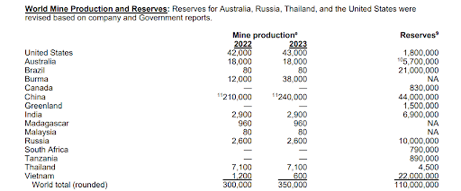

+++
title = 'Gronelândia'
date = 2024-02-01T16:00:00+01:00
draft = false
tags = ['geopolitica', 'direito-internacional', 'eua', 'gronelandia']
giscus_term = "greenland-20240201"
+++

Donald Trump teve um telefonema com a primeira ministra dinamarquesa no passado dia 24 de janeiro sobre a Gronelândia. Donald Trump já demonstrou a sua ânsia em conquistar a Gronelândia. Tem vindo a ser criticado por ser uma ideia radical, mas não é o primeiro a fazê-lo na história. Aliás, os EUA têm uma longa história de expansão territorial e por algumas vezes já foi discutida a aquisição deste território no passado.

## História da Expansão Territorial dos EUA

Em 1803, os Estados Unidos compram o Estado da Louisiana. (Alguns Estados americanos adquiridos, na federação eram só 13 estados inicialmente).

Em 1867, compram o Alasca ao império russo, o que faz com que os EUA passem a ser um estado ártico. Em 1870, altura em que o império russo estava em muitas dificuldades económicas.

E quem dominava o Canadá ao norte dos estados unidos era o império britânico. O império russo vende aos americanos por 7 milhões de dólares o Alasca.

Relativamente à Dinamarca, os EUA compram em 1917, um pouco a sul do golfo do México, 3 ilhas (São João, São Tomás e Santa Cruz). O antigo arquipélago das Índias Ocidentais Dinamarquesas, atualmente conhecidas como Ilhas Virgens Americanas, por 25 milhões de dólares.

Uma vez que a Gronelândia é uma ilha, existe uma grande dificuldade em manter a coesão nesses territórios, por causa da sua distância.

## Tentativas Anteriores de Aquisição da Gronelândia

O mesmo presidente que comprou o Alasca, Andrew Johnson, 1867, também tentou a sua sorte. Nessa altura, também se falou na compra da Islândia e da Gronelândia. Nessa altura, fizeram-se relatórios da potencialidade da ilha. 5,5 milhões de dólares em ouro oferecidos pela Gronelândia. Não chegou a ir para a frente a oferta por questões de confidencialidade dentro do governo americano.

Já no século XX, em 1910 durante o mandato de William Taft, a Gronelândia continuou a ser um tópico nuclear, mas pretendia-se não uma compra e venda, mas sim uma permuta. Havia uma ilha das Filipinas que os EUA cederiam à Dinamarca. Depois passadas essas ilhas das Filipinas e uma troca de terrenos com a Alemanha na Gronelândia. Também não seguiu para a frente, por questões interiores.

Mais tarde em 1946, depois da Segunda Guerra Mundial, com as tensões entre os EUA e a URSS. Antes, em 1943 os americanos chegaram a ocupar a Gronelândia por receios dos nazis aí chegarem. Mais tarde, Truman propõe formalmente à Dinamarca por 100 milhões de ouros, mas é recusada.

## Por que os EUA Estão Interessados na Gronelândia Agora?

Em termos geográficos - rota do Ártico, maiores potencialidades na lógica de controlar parte desta rota. Questão militar e estratégica, futuras bases – os chineses estão interessados também. Trump elege a China como país com quem pode partilhar alguma soberania.

Recursos naturais, gás petróleo – terras raras. Isto é, elementos que sem eles não há transição energética. Há 24 milhões de reservas na Gronelândia para chips, baterias. É um espaço organizado, porque já vivem pessoas lá.

## O Princípio da Autodeterminação

A parte do direito sempre foi atropelada no meio destas negociações. A parte autonômica da Gronelândia é crucial. Até houve alterações da constituição que permitem a associação da Gronelândia com outros estados. Para ficar na órbita europeia e ser a Europa a se projetar para o Ártico.

## Conclusão

A questão da Gronelândia continua a ser um tema complexo nas relações internacionais. Apesar do interesse histórico dos EUA, as mudanças no direito internacional e a crescente autonomia da Gronelândia tornam qualquer tentativa de aquisição muito mais complicada nos dias de hoje. A solução pode estar mais na cooperação internacional do que na aquisição territorial.
